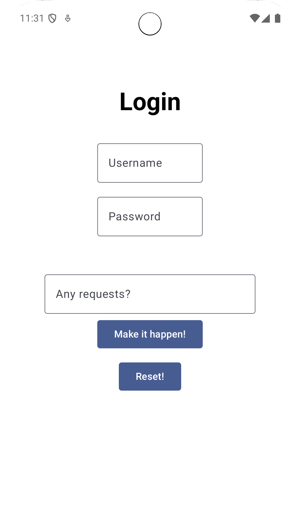

# DynamicUI

This is an Android project made with the goal of being able to change the UI elements through LLM prompts. It was made in the most generic way possible, so that the LLM can accept a range of different inputs that can achieve the same goal.

The project is using the API key directly on the code, despite knowing that this is a security vulnerability. It was intentionally made this way in order to run seemlessly (with one click). But the correct way to use the API key in an Android project is to use BuildConfig by setting an API variable at gradle.properties.

All the examples below were tested, but the application is not limited to them. This also mean that depending on the input, the application can break, since security was not the focus of this project.

#### On the first screen:
- "Make the first text box bigger";
- "Make the first text box wider";
- "Make the first text box wider and the second one taller";
- "Make the first text box wider, the second one taller and the background red!";
- "Make everything bigger!"
- "Make everything smaller!"
- "Change the title to something fancy!"

#### Access the next screen:
- "Log me in!"
- "Take me to the other screen!"
- "Take me to the next screen!"

#### Once on the second screen, you can also return with this prompt:
- "Take me back"

#### On the List screen, the only feature implemented is to order the list. These prompts were tested:

- "Order these numbers in ascending order"
- "Order these numbers in reverse order"
- "Order my list"
- "Order this list"

# Running the project
In order to execute the project, open it on Android Studio, assign an Android Virtual Device by going in `Tools -> Device Manager` and press the Run button. Or, generate an APK through `Build -> Generate App Bundles or APKs -> Generate APK` and install on your device.

 


#### Here is the folder structure of this project:
``` bash
├─📁 dynamicui
│  ├─📄 MainActivity.kt
│  ├─📁 data
│  │  ├─📁 remote
│  │  │  ├─📄 AssistantResponseAPI.kt
│  │  │  └─📄 RetrofitClient.kt
│  │  └─📁 repository
│  │     └─📄 AssistantResponseRepositoryImpl.kt
│  ├─📁 di
│  │   ├─📄 App.kt
│  │   └─📄 modules.kt
│  ├─📁 domain
│  │  ├─📁 model
│  │  │  └─📄 AssistantModel.kt
│  │  └─📁 repository
│  │     └─📄 AssistantResponseRepository.kt
│  └─📁 ui
│    ├─📁 listScreen
│    │  ├─📄 ListScreen.kt
│    │  ├─📄 ListScreenState.kt
│    │  └─📄 ListScreenViewModel.kt
│    ├─📁 loginScreen
│    │  ├─📄 LoginScreen.kt
│    │  ├─📄 LoginScreenViewModel.kt
│    │  └─📄 LoginUIState.kt
│    └─📁 theme
│      ├─📄 Color.kt
│      ├─📄 Theme.kt
│      └─📄 Type.kt
```